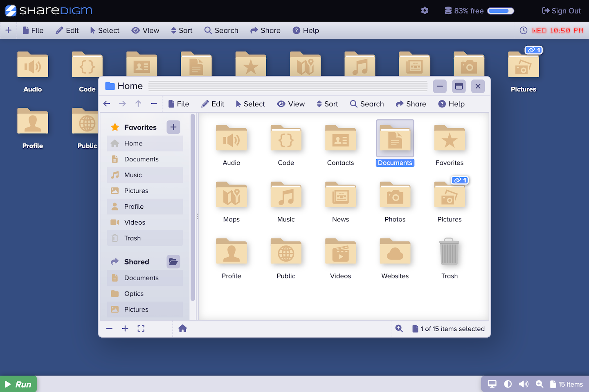

	

# Sharedigm OS

Sharedigm OS is an open source, cloud based operating system.  It can be used to build cloud based community platforms for a wide variety of applications.

	
	
Welcome

	
	
Desktop

## Features

The Sharedigm OS can be used as a cloud operating system to manage and share your files or to build cloud based platforms for a wide variety of purposes. 

- Manage your files.
- View your files from any connected device (mobile, tablet, or desktop).
- Share files and folders by link.
- Install other apps to add a wide variety of capabilities.
- Apply themes to customize the look and feel.

## Benefits

By installing the appropriate apps, you can use the Sharedigm platform for a wide variety of purposes:

- View and share photos or images.
- Manage and play your music and audio.
- Store and play your videos and movies.
- Back up and share your source code.
- Engage is discussions through discussion topics.
- Communicate through private direct messaging.
- Generate images using AI.

## Examples

Below are some examples of web platforms that have been built on top of the Sharedigm OS.  Use Sharedigm OS to build your own web platform!

	<a href="https://dreamachines.ai">
		
		<b>Dreamachines.ai</b>
	</a>
	
Dreamachines is a platform for creating and sharing AI generated images.

	<a href="https://opticexplorer.com">
		
		<b>OpticExplorer.com</b>
	</a>
	
OpticExplorer is a platform for designing and analyzing optical systems.

	<a href="https://easybucket.org">
		
		<b>EasyBucket.org</b>
	</a>
	
EasyBucket is a platform for easily managing and sharing your S3 bucket data.

	<a href="https://rocketkitty.org">
		
		<b>RocketKitty.org</b>
	</a>
	
RocketKitty is an entire collection of self-hostable platforms for a variety of purposes including:
		<ul>
			<li><a href="https://www.chatkitty.org">ChatKitty</a> - Share discussions and direct messages. </li>
			<li><a href="https://www.mapkitty.org">MapKitty</a> - Share your geolocated data. </li>
			<li><a href="https://www.datakitty.org">DataKitty</a> - Share your data and your conversations. </li>
			<li><a href="https://www.photokitty.org">PhotoKitty</a> - Share your photos and images. </li>
			<li><a href="https://www.sourcekitty.org">SourceKitty</a> - Manage and share your source code. </li>
			<li><a href="https://www.filekitty.org">FileKitty</a> - Manage and share your data. </li>
			<li><a href="https://www.s3kitty.org">S3Kitty</a> - Manage and share your S3 bucket data. </li>
			<li><a href="https://www.dreamkitty.org">DreamKitty</a> - Create and share AI generated images. </li>
			<li><a href="https://www.musickitty.org">MusicKitty</a> - Manage and play your music and audio. </li>
		</ul>
	

## Apps

By default, Sharedigm OS comes with a limited set of apps pre-installed (shown below).  Many more apps are available for download from the [Sharedigm App Store](https://github.com/Sharedigm/SharedigmAppStore).  These applications are provided in source code form and may be easily installed and uninstalled to your Sharedigm OS instance throuugh a smpe installer mechanism.

	<a href="https://github.com/Sharedigm/SharedigmAppStore/tree/main/apps/app-launcher">
		
		<b>App Launcher</b>
	</a>
	
The App Launcher app is used to launch (start / run) other applications.

	<a href="https://github.com/Sharedigm/SharedigmAppStore/tree/main/apps/file-browser">
		
		<b>File Browser</b>
	</a>
	
The File Browser app lets you view, arrange, open, and manage your files.

	<a href="https://github.com/Sharedigm/SharedigmAppStore/tree/main/apps/help-viewer">
		
		<b>Help Viewer</b>
	</a>
	
The Help Viewer app lets you browse the online help pages.

	<a href="https://github.com/Sharedigm/SharedigmAppStore/tree/main/apps/settings-browser">
		
		<b>Settings Browser</b>
	</a>
	
The Settings Browser app lets you browse system settings and app preferences. 

	<a href="https://github.com/Sharedigm/SharedigmAppStore/tree/main/apps/settings-manager">
		
		<b>Settings Manager</b>
	</a>
	
The Settings Manager app lets you view and modify system settings and app preferences. 

## Installation

Please follow the instructions in [documentation/INSTALL.md](documentation/INSTALL.md) to install the software on your web server.   If you would like some pointers for configuring your web server, see:  [documentation/CONFIG.md](documentation/CONFIG.md).

<!-- LICENSE -->
## License

Distributed under the Sustainable Use License which allows urestricted use of the software but does not allow you to commercialize it. See [LICENSE.md](LICENSE.md) for more information.

<!-- CONTACT -->
## Contact

mailto:admin@sharedigm.com